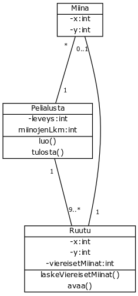
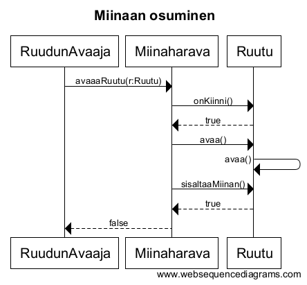
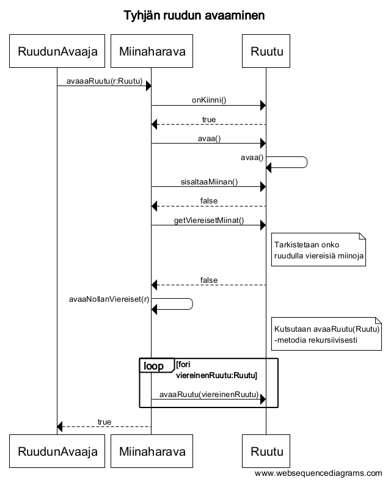

#Aihemäärittely

**Aihe:**

Miinaharava, peli jossa n x n ruudukkoon piilotetaan m määrä "miinoja" ja pelaajan on tarkoitus löytää ne räjäyttämättä yhtään.
Pelaaja räjäyttää miinan, jos hän avaa ruudun, jossa on miina. Peli päättyy kun kaikki miinat on löydetty tai jos pelaaja räjäyttää miinan.

Jokainen ruutu ilmoittaa avatessa viereisten miinojen määrän.

Pelissä voi olla useita vaikeusasteita riippuen ruudukon koosta ja miinojen määrästä. Pelin loputtua ilmoitetaan käytettyjen vuorojen määrä.

**Käyttäjät:**

- Pelaaja

**Pelaajan toiminnot:**

- Pelin aloitus
- Ruudun avaaminen
- Ruudun merkkaaminen
- Pelin lopetus

##Luokkakaavio  
  

##Sekvenssikaavioita  
  
  
  