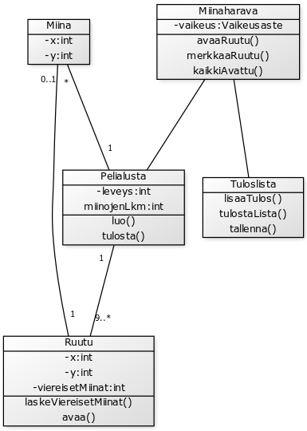
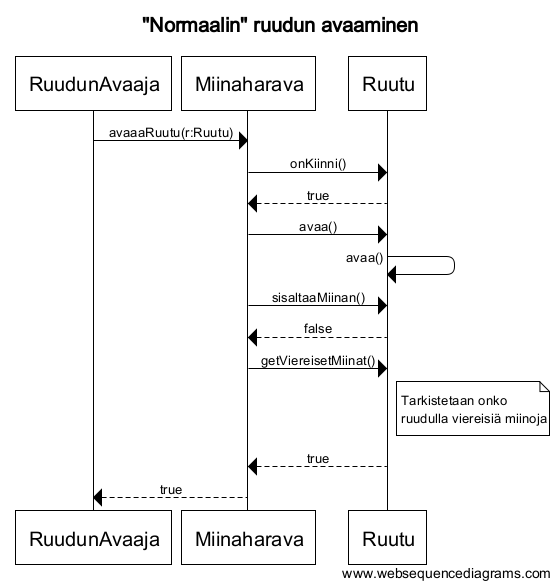

#Aihemäärittely

**Aihe:**

Miinaharava, peli jossa X x Y ruudukkoon piilotetaan N määrä "miinoja" ja pelaajan on tarkoitus avatta kaikki miinattomat ruudut räjäyttämättä yhtään miinaa.
Pelaaja räjäyttää miinan, jos hän avaa ruudun, jossa on miina. Peli päättyy kun kaikki miinat on löydetty tai jos pelaaja räjäyttää miinan.

Jokainen ruutu ilmoittaa avatessa viereisten miinojen määrän.

Pelissä voi olla useita vaikeusasteita riippuen ruudukon koosta ja miinojen määrästä. Pelin loputtua ilmoitetaan peliin kuluneen ajan määrä.

**Käyttäjät:**

- Pelaaja

**Pelaajan toiminnot:**

- Pelin aloitus
- Ruudun avaaminen
- Ruudun merkkaaminen
- Pelin lopetus

##Luokkakaavio  
  

##Sekvenssikaavioita  
  
  
  